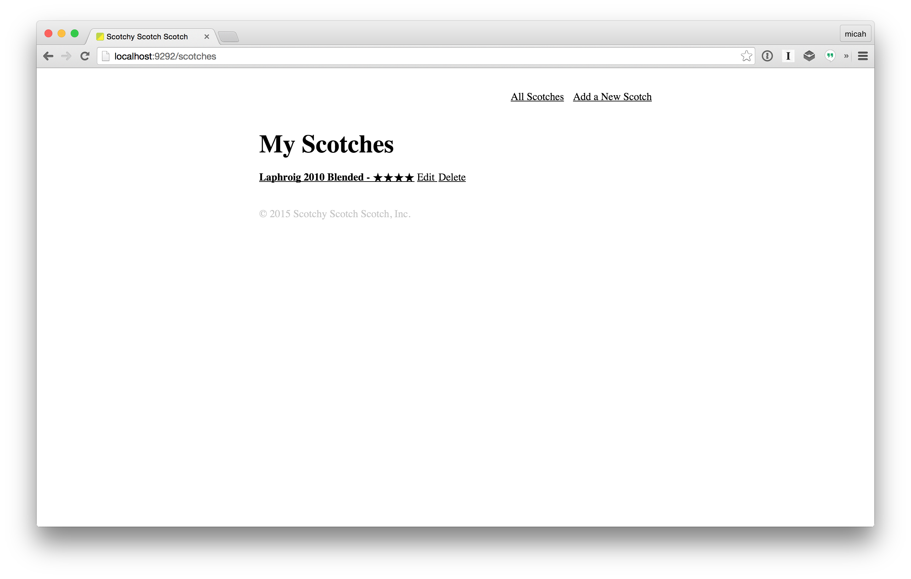
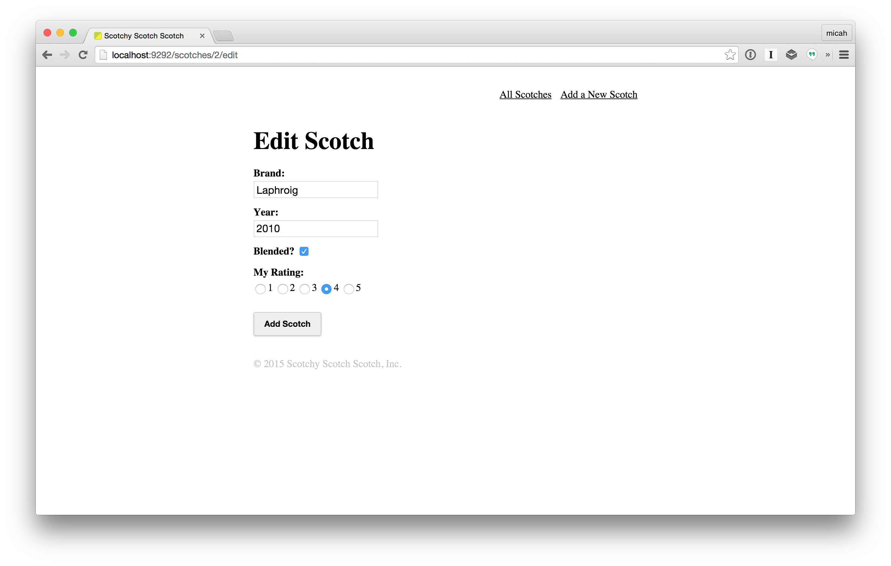

# Weekend Sinatra App

## Introduction

To practice everything we've learned this week, your task this weekend is to 
build a full-blown Sinatra app from scratch. It should have full CRUD for a 
single model, with a RESTful controller and views.

What can you make? You're welcome to be creative, but if you need some ideas:

- An app to help organize your fancy scotch collection
- An app for a library to know which books are currently lent out
- An app for a restaurant kitchen to know what orders have come in

As long as you're practicing the skills we've learned this week and making an 
awesome app, you'll win.

## Exercise

- Use ActiveRecord to make a SQL-backed model
- Make a RESTful controller that renders views (don't forget new, show, 
  edit, too!)
- Make templates with ERB
- Use them CSS skills, make it look great!

#### Deliverable

You should end up with a functioning one-model CRUD application built in 
Sinatra.

Here's an example:

## Additional Resources

- Refer back to all the code you've written this week! You should have 
  everything you need to make a fully functional app!
- [Sinatra Docs](http://www.sinatrarb.com/intro.html)
- [Rails Guides – ActiveRecord](http://guides.rubyonrails.org/active_record_basics.html)
